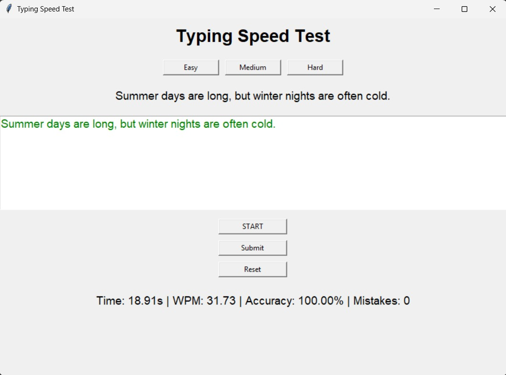
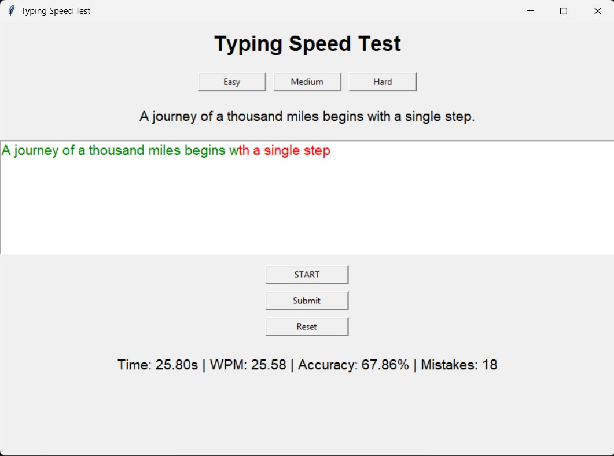

# Typing-Speed-Calculator

Python Tkinter GUI typing speed test that measures WPM, accuracy, time, and mistakes with multiple difficulty levels and real-time feedback.

---

##  Project Description

This project is a Python-based GUI Typing Speed Test application developed using **Tkinter**. It allows users to test and improve their typing skills by providing performance metrics such as **Words Per Minute (WPM), accuracy percentage, time taken, and number of mistakes**. The application includes multiple difficulty levels and real-time visual feedback to make the typing experience interactive and effective.

---

##  Features

- Difficulty levels: **Easy, Medium, Hard**
- Random sentence selection from external text files
- Automatic timer start on first keystroke
- Real-time character highlighting  
  - Green for correct characters  
  - Red for incorrect characters
- Calculates WPM, accuracy, mistakes, and time
- Submit using **Enter key** or **Submit button**
- Reset option to restart the test

---

## Application Output

### Output without Errors


### Output with Errors



---

##  Technologies Used

- Python 3  
- Tkinter (GUI framework)  
- File handling and string processing  

---

### Project Structure

```
Typing-Speed-Calculator/
├── main.py
├── easy.txt
├── medium.txt
├── hard.txt
├── images/
│   ├── typing_without_mistakes.jpg
│   └── typing_with_mistakes.jpg
└── README.md
```


##  How to Run

1. Install Python 3 on your system.
2. Download or clone this repository.
3. Ensure all `.txt` files are in the same directory as `main.py`.
4. Run the application using:
5. Select a difficulty level and start typing.

---

##  Learning Outcomes

- GUI development using Tkinter
- Event handling and user input processing
- File handling in Python
- Basic performance calculations

---

##  Future Enhancements

- Typing history or leaderboard
- Improved UI design
- Longer and customizable passages
- Export results to a file

---

Developed as a Python learning project using Tkinter.

